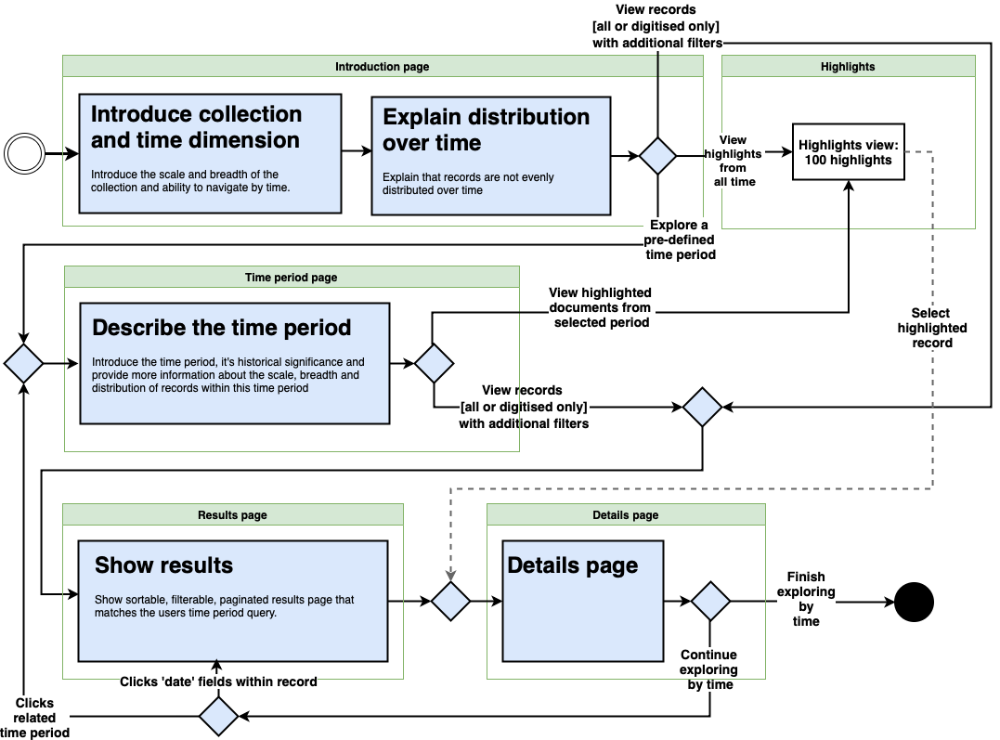

# Pre-sprint proposal 

## Approach

This prototype seeks to improve the current prototype, addressing the known issues, while still meeting the [spirit of generous interfaces](https://pro.europeana.eu/page/issue-11-generous-interfaces)

> “humans like to look, we don’t like to search”

and ...

> “Generous interfaces offer rich, browsable views; provide evocative samples of primary content; and support an understanding of context and relationships”

| Moving from | Moving to  | Rationale | 
|---|---|---|
| All controls and results being immediately visible   | Leading the user through a process where **information, concepts (time periods, distributions etc.) and controls are introduced in a logical sequence**  | This is based on an assumption that it will allow us to focus the user on key information and help novice users process necessary information  |
| All controls and results being immediately visible  | **Presenting one idea and set of related choices per page**  | It is hoped this will help new and novice users by: providing the user with a sense of progress through their refinements, and; focusing the content on explaining the current step and the options which relate to it.  |
| A single interface which mixes controls and results | Separating interfaces where users make choices from the interfaces that show the consequences of those choices | This is to give users a clearer sense of the _whole_ impact of their choices. For example, it is not necessarily clear in the current interface that changing a date period results in a change to the number of records, the record listing, the distribution graphic and available subject filters. |
| A heavy reliance upon graphical elements | Placing **greater responsibility on textual content to convey critical information**  | This is on the basis that it will improve accessibility and afford us more flexibility when determining the best visualisation and/or infographic approach at different screen resolutions. |
| An interface that merges content with controls  | **A clear separation between content that is designed to communicate information and controls** which change the data being represented | This is to simplify the user interface and avoid the frustration caused by affordance issues (where users expect to be able to interact with parts of the widget) |
| A single result listing which includes relevant highlights | **Introducing a specialist view for 'highlights'**  | This is on the basis that highlights are special and, while we can still present them interspersed withing 'normal' records, there is an argument for there to be an interface designed specifically for users that are interested only in the highlights from a given period or all time. |
| The use of custom JavaScript widgets | using **using standard browser controls** as the default interaction mechanism ||

## Running the code 

from this directory run `php -S localhost:8000` in Terminal. Then visit [localhost:8000](http://localhost:8000)

